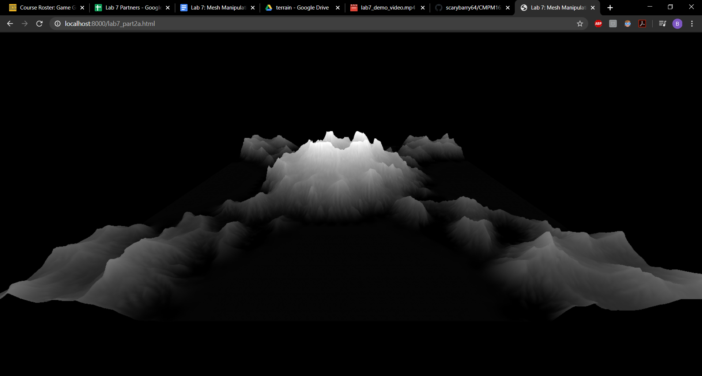

# CMPM163Labs
 
 
# Lab 2

Video: https://drive.google.com/file/d/1FH0aVV149_2M6mAkc414s7KPxrNHsHsl/view?usp=sharing

Screenshot: 

# Lab 3

Video: https://drive.google.com/file/d/1lCTCOwpgDgZ4DowcpvEWmLrhn2L8_4_x/view?usp=sharing

How: (From left to right) The first cube is made using shaders. I simply copied the code provided in the lab for making the other shader cube, though I made a separate fragment shader per the instructions. I then changed the color to lime, and had it rotate on the z-axis. The second cube is made using Three.js materials. It's the first cube made per the instructions. It has a grey phong material, with some specular and shininess. The lighting adds a greenish tint to the cube too. The third cube (my favorite) is also made using Three.js materials. For this, I used a toon material and colored it orange. I tweaked its specular, shininess, transparancy, and opacity to give it a shiny see-through look. The lighting makes it pulse magenta once it hits a certain angle as it rotates in the negative x direction. Lastly is the second cube mader per the instructions. It uses shaders, mixing colors to achieve a cyan sheen with hints of blue on its lower corners.

# Lab 4

Video: https://drive.google.com/open?id=1b7r3TuA5xE15Tofzve2w6at6cpShX7ZJ

How: 
- Cube 1 (Left): Using three.js built in texture functionality, I gave this cube a grassy-stone texture. It has no normal map, and thus looks quite dull. Being off the left by 2, you can see its right side.
- Cube 2 (Center): This is essentially the same as Cube 1, but it has a corresponding normal map which makes it look fairly detailed as if it's bumpy. Being in the center, you cannot see its sides.
- Cube 3 (Right): Again similar to Cube 1, but this time it uses a sandy-brick texture and corresponding normal map. It's also off to the right by 2, meaning you can see its left side.
- Cube 4 (Top): This uses shaders per the instructions. I gave it a pinkish texture, possibly old paint on metal or wood. It has no normal map, and so looks quite dull. It's up by 2, meaning you can see its bottom side.
- Cube 5 (Bottom): My favorite! This is similar to Cube 4, except I did some math magic to give it a 4x4 tiled wood texture. Basically, I took the varying vec2 "vUv" passed from the vertex shader and modded it by 0.25 then multiplied it by 4.0 in the fragment shader, storing this as "vUv2". Then, I passed this in the texture2D function in the fragment shader. The result is a 4x4 cube, in which the original wood texture repeats itself in a 4x4 grid on each side. See line 61 in lab4.html for the magic. Cool! This cube is down by 2, meaning you can see its top.

Answers:
- a) To get the x coordinate from a given u value, multiply u by 8. Formula: x = 8 * u
- b) To get the y coordinate from a given v value, multiply v by 8. Formula: y = 8 * v
- c) White is the color sampled from the texture at uv coordinate (0.375, 0.25), which corresponds to (3, 2) on the texture.

# Lab 5 (Part 2)

Video (a): https://drive.google.com/open?id=1C9ZucNlukZh1-qtxaPmZEQA1eXvk4Rsq
 
Video (b): https://drive.google.com/open?id=1-I7vEGlgaAQ7-i1cRp2r-2U7Egl-CBUh
 
Video (c): https://drive.google.com/open?id=17s5ZIPjg0n51DsOTRDrzD8_GKics3lIz
 
How I Made "The Rainbow Batman Symbol":
While browsing the internet for "cool looking graphs", I encountered a graph of the Batman symbol. I instantly knew I would set forth to implement this in THREE.js. This crime-fighting graph comes courtesy of the "Batman equation", a rather disgusting mess of formulas I found here: https://math.stackexchange.com/questions/54506/is-this-batman-equation-for-real. This graph is made of 6 parts, together forming the outline of the Batman symbol. Using THREE.js, I began with the particle texture from Part 2a and the explosion template from Part 2b. Instead of the particles going infinitely in all directions, I bounded the particles within the outline formed from the Batman equation. I used a series of lengthy formulas (these took a long time!) and checks to see when each particle reaches the edges of the Bat-bounds. When this happens, that particle is re-positioned to a random spot somewhere else inside the Bat-bounds. Lastly, I made the particles change colors at random. This took some tweaking, but I was able to get it to produce a cool pulsating rainbow neon effect that flickers. The end result is 15,000 particles continuously darting around the Bat-bounds to form a gaseous rainbow of cape-crusading glory. Take that, Joker!

# Lab 6 (Part 2)

Screenshot: 

Link to *My* Cool Shadertoy: https://www.shadertoy.com/view/3dffWf

Link to *Someone Else's* Cool Shadertoy: https://www.shadertoy.com/view/4lGyW1

# Lab 7 (Part 2)

Height Map Screenshot: 

Alternate Texture Screenshot: 

Video of Ripple Effect: https://drive.google.com/file/d/1OAE16n8XFCRfEBH04LUG9fTmOSoVgStR/view?usp=sharing

Part 2c Screenshot - "Shark-cano": 

Partner Check-In:
Unfortunately, I was unable to contact my partner (Daniel Liao). I couldn't find him in Discord (I even posted his name in the class chat). As such, I did this lab solo.
